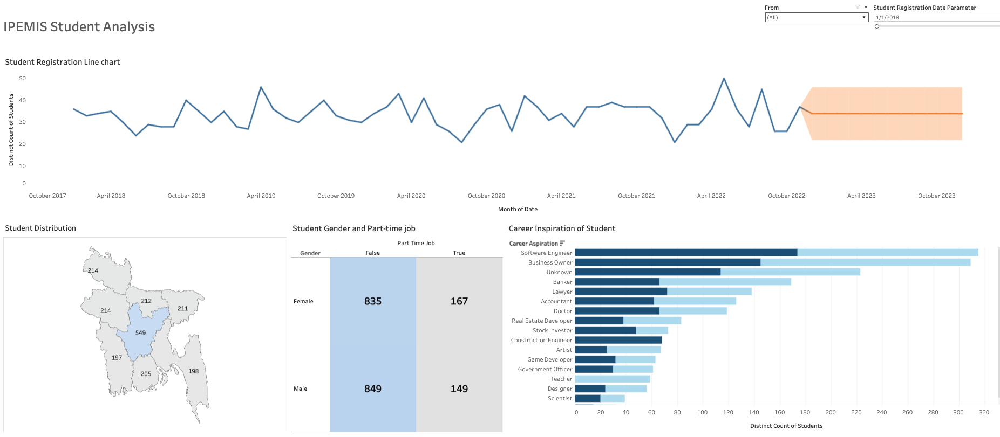

# IPEMIS_academic

# Project Background
The Directorate of Primary Education (DPE), Bangladesh has launched and implemented a software system, namely Integrated Primary Education Management Information System (IPEMIS) to provide quality education for all children in Bangladesh. 

The [IPEMIS](https://ipemis.dpe.gov.bd/) system has significant amounts of data on user records, administrative efforts, operational efficiency, and governance data that has been previously underutilized. 
This project thoroughly analyzes and synthesizes the data of an IPEMIS Couching program  in order to uncover critical insight that will improve IPEMIS data-driven decisions on different administrative and governance aspects.

## Business Question
Insights and recommendations are provided on the following key areas:

This project aims to visualize academic and registration activities on a sample snapshot of  [Please, follow the link](https://public.tableau.com/views/IPEMISSTUDENTREGISTRATION/Dashboard1?:language=en-US&:sid=&:redirect=auth&:display_count=n&:origin=viz_share_link)

1. What are the trends of student registration over time?
2. Does Female studends lack in registering the program?
3. How are the registered students distributed accross the country?
4. What are the career aspiration they have?

## DataSet

The data is stored in the `data` folder. Its also publicly available in Bangladesh Primary Education

## Code

The code is stored in the `code` folder.

## Report

The report is stored in the `report` folder.
