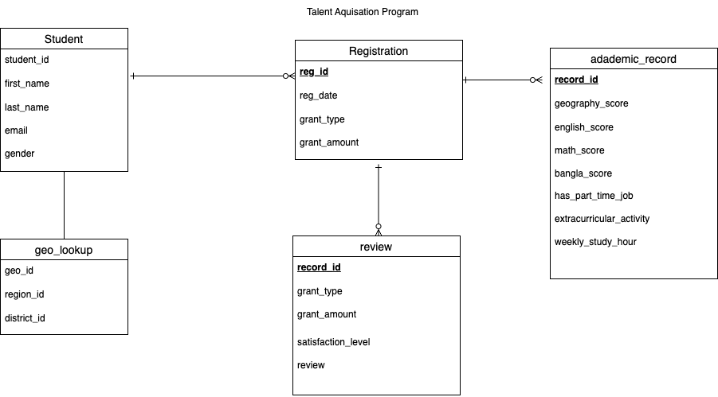

# IPEMIS_academic

# Project Background
The Directorate of Primary Education (DPE), Bangladesh has launched and implemented a software system, namely Integrated Primary Education Management Information System (IPEMIS) to provide quality education for all children in Bangladesh. 

The [IPEMIS](https://ipemis.dpe.gov.bd/) system has significant amounts of data on student records, administrative efforts, operational efficiency, and governance data that has been previously underutilized. 
This project thoroughly analyzes and synthesizes the data of an **IPEMIS Talent Hunt Program** in order to uncover critical insight that will improve IPEMIS data-driven decisions on different administrative and governance aspects.

## Business Question
Insights and recommendations are provided on the following key areas:

1. **Student registration trends over time**: Evaluation of historical student registration patterns over time, both globally and by region, focusing on demographic and academic records

2. **Student Performance and comparison**:

3. **Talent Hunt program success**: Analyzing the overall success of the program through distinct domain metrics change over time, such as Student retention Rate (SRT), Diversity index (DI)

1. What are the trends of student registration over time?
2. Does Female studends lack in registering the program?
3. How are the registered students distributed accross the country?
4. What are the career aspiration they have?

## Data Structure and cleaning

IPEMIS Talent aquisition datastructure consists of four tables as seen below : user, geo_lookup, registration, with a total row count of 108127 records.  Its also publicly available in Bangladesh Primary Education.

Prior to beginning the analysis, a variety of data cleaning and quality check actions were conducted for quality control and familirazation with the dataset. The script utilized to inspect and perform quality checks can be found here.

## Code

The code is stored in the `code` folder.

## Report

This project aims to visualize academic and registration activities on a sample snapshot of  [Please, follow the link](https://public.tableau.com/views/IPEMISSTUDENTREGISTRATION/Dashboard1?:language=en-US&:sid=&:redirect=auth&:display_count=n&:origin=viz_share_link)
